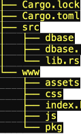

# Wasm rust Chinese Writer
This a port to wasm of my Rust Chinese writer.
Additionally, the 'dictionary' is no longer a sqlite file but a rust Vec (derived from the sqlite file by a small ad hoc rust utility and stored in data.rs).

## Rationale
I wanted to write a version that still worked in the browser but did not require any internet connection once the module was loaded in the browser.

I had worked with rust+wasm in 2020 and still remember a horrible experience with node.js packaging. When I discovered the [no bundle version of the wasm-bindgen guide](https://nobundle.github.io/book/examples/wasm-bindgen_guide.html) suddenly writing wasm with rust became fun again.

I adopted the project layout of the nobundle guide (except for index.html, which I moved to the root of the www directory):



The pkg directory is generated by wasm-pack with the following command:
```
 wasm-pack build --target web --no-typescript --out-dir www/pkg
```

To test the program locally, just use python:
```
python -m http.server --directory www 8080
```
and point your browser to localhost:8080

## Shortcut keys

The Esc key is avaible when and only when a Cancel button is available, with the same effect : to cancel the currently active form.

The Enter key is not managed by the program. When a form is active it fires form submission.

The following keys: p (pinyin form), z (zi form) and s (string parser form), are available when and only when no form is active on the page. Consequently, they are not available in the "Write hanzi text" page.

The shortcut keys are activated and deactivated in index.js, chinesewriter.js and lib.rs (wasm module).

## Development : using forms

After working through the nobundle guide [no bundle version of the wasm-bindgen guide](https://nobundle.github.io/book/examples/wasm-bindgen_guide.html), especially examples 1.1, 1.4 and 1.5,
development was quite easy, except for `form` management, which requires web-sys Closure (partially shown in example 1.7 but with no complete form example).

I found relevant information in [https://sebastian.lauwe.rs/blog/rust-wasm-form-validation/](https://sebastian.lauwe.rs/blog/rust-wasm-form-validation/) as well as an almost working example in [https://codeberg.org/teotwaki/rust-wasm-form-validation-tutorial/src/branch/main/wasm/src/lib.rs](https://codeberg.org/teotwaki/rust-wasm-form-validation-tutorial/src/branch/main/wasm/src/lib.rs), which solved the issue for me.

One issue for which I had to create my own solution was that of closure conservation, in order to keep the closure available after it goes out of scope. 

All available examples use "closure.forget()", which means some memory gets allocated for storing the closure, creating a memory leak if many closures are created. Instead, I use a thread_local static variable to store the closure within a Cell element, meaning each new closure replaces the preceding one, which is perfectly ok with this program since I have at most one form active (showing in the browser) at any given time.

## Deployment 

Apparently there are no more constraints for wasm on the browser (client) side. But there still remain issues on the server side.

When I deploy on my usual hosting provider it works, but on the console I get a message `WebAssembly.instantiateStreaming` failed because your server does not serve Wasm with `application/wasm` MIME type. Falling back to `WebAssembly.instantiate` which is slower. Original error:
 TypeError: Failed to execute 'compile' on 'WebAssembly': Incorrect response MIME type. Expected 'application/wasm'.
 
Try it on [https://eludev.fr/wasmzidian/](https://eludev.fr/wasmzidian/)
 
I suppose this is still unfortunately the case with many hosting providers (mine is IONOS).
 
To get a a proper wasm service I deployed the app to Netlify, whith several advantages:
 - it is free :-)
 - it allows for effective wasm service
 - it has a simple continous deployment mechanism (through github)
- it allows me to use a subdomain of my own domain : in this case wasmzidian.eludev.fr, which points to wasm-chinesewriter.netlify.app/

Watch live at [https://wasmzidian.eludev.fr/](https://wasmzidian.eludev.fr/)
